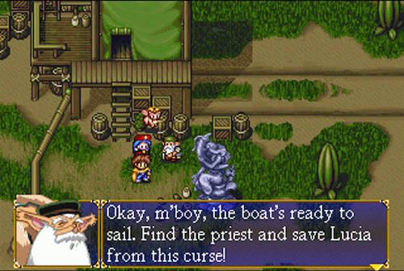

# Clojure Basics

## Description

Do all the "elementary" problems on 4clojure. Consider reading through [Do Things: A Clojure Crash Course](http://www.braveclojure.com/do-things/) to review Clojure fundamentals.

## Requirements

* [Login to 4clojure](https://www.4clojure.com/login)
* Complete all the [problems](https://www.4clojure.com/problems) marked as elementary
* Optional: Keep working on problems with higher difficulty levels
