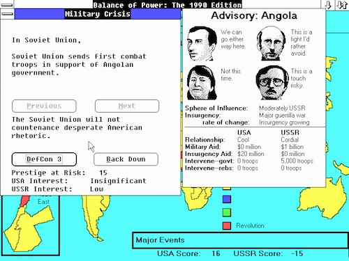

# Clojure Review

## Description

Modify the Clojure and Java cards projects we made in class so they can filter several other poker hands.

## Requirements

* Write the following functions
  * `straight-flush?` returns true if the given cards have the same suit and the ranks are in a sequence
  * `straight?` returns true if the given cards' ranks are in a sequence but are not a straight flush
  * `four-of-a-kind?` returns true if the given cards have the same rank
  * `three-of-a-kind?` returns true if only 3 of the given cards have the same rank
  * `two-pair?` returns true if 2 of the given cards have the same rank, and the other 2 have the same rank
* Write a test for each function to prove that they work as expected
* Write these functions in the Java `Cards` project
