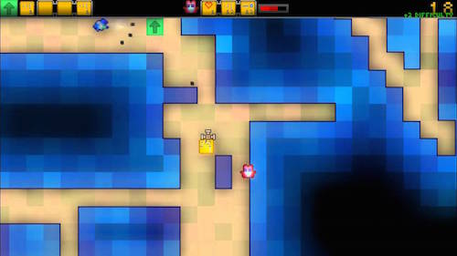
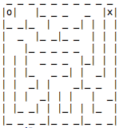

# Clojure Recursion

## Description

Modify the Clojure and Java maze projects we made in class to show the begin and end points.

## Requirements

* Use the screenshot below for reference.
* Make the starting point at 0,0 display an `o`. Consider finding a way to set its `:start?` key to true, then in your `-main` function you can make it print out an `o` instead of a `_` if that key is present.
* Make the first dead end display an `x`. Recall that a dead-end is reached when `random-neighbor` returns `nil` in the `create-maze` function. Find a way to make the room at `row` and `col` have an `:end?` key set to true *if* no room already has been marked with it.
* Do the same for the Java Maze project.

