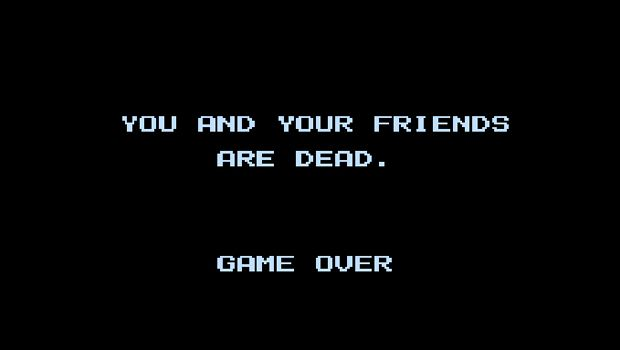

# Clojure Parallelism

## Description

Modify the Clojure and Java ants projects we made in class to make the ants turn red when they get too close to another ant.

## Requirements

* Store the color of each ant inside itself with the `:color` key. They should start off as black. Then make `draw-ants` use this value to draw the color of the ant instead of hard-coding it as `Color/BLACK`.
* Write a function called `aggravate-ant`. It should filter over all the ants to find the ones that are within 10 pixels of it (you can determine this by calculating the difference between the ants' `:x` and `:y` in the filter function, using the `Math/abs` function to get the absolute value). If the result of the filter is one, then set the ant's `:color` to `Color/BLACK` (because that one result is the ant itself!). Otherwise, set it to `Color/RED`.
* Modify the line where you are calling `(pmap move-ant (deref ants))` so it maps over the result with `aggravate-ant`. It should look like this: `(doall (pmap aggravate-ant (pmap move-ant (deref ants))))`.
* Add `(Thread/sleep 1)` to `aggravate-ant`. Verify that you are getting better framerates with `pmap` than with `map`.
* Write the same functionality in the Java `Ants` project.
